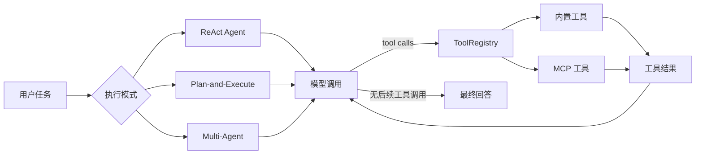
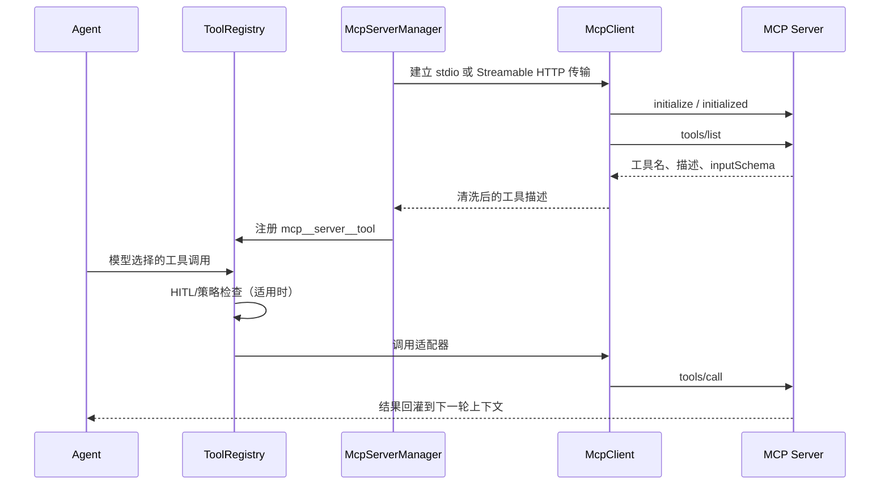
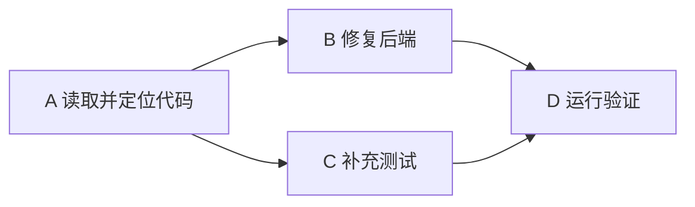

# Simple CLI 核心职责面试准备

> 根据当前仓库源码整理，核对日期：2026-09-18。面试时先讲自己能解释和定位的实现，再讲边界及改进方向。仓库的阶段开发文档可能保留旧设计；发生冲突时以当前源码为准。

## 一、先用 60 秒讲清项目

> Simple CLI 是一个 Java 终端编程 Agent。默认模式通过 ReAct 循环让模型选择工具、读取执行结果并继续推理。围绕这条主链路，项目增加了基于 SQLite 的后台任务队列、跨会话记忆、MCP 外部工具接入，以及 Plan-and-Execute 和 Multi-Agent 协作。对代码库问题，优先使用实时文件搜索和读取，语义 RAG 作为辅助。我的核心工作可以按「执行、持久化、记忆、工具接入、协作」五部分展开。

项目有三条主执行路径：默认 ReAct 对应 `Agent`，`/plan` 对应 `PlanExecuteAgent`，`/team` 对应 `AgentOrchestrator`。它们会复用工具注册表等基础组件，但调度和审查逻辑各自不同。



**面试总原则：**把「模型决定什么」「Java 程序保证什么」「目前尚未保证什么」说清楚。模型能提出工具调用；Java 代码负责执行、状态管理、超时、审批和结果回灌。模型评审与摘要也会出错，因此不能把它们描述为确定性保证。

## 二、职责 1：ReAct、并行执行、Token 预算与压缩

### 2.1 适合面试开场的回答

> 我在 `Agent` 中实现了循环式工具调用。每一轮先整理对话历史和工具定义，再请求模型。模型如果返回工具调用，就通过 `ToolRegistry` 执行，把结果作为 tool message 回灌并进入下一轮；如果没有工具调用，就返回最终回答。同轮多个工具调用最多 4 个并发。上下文长度由模型窗口动态决定压缩阈值，接近阈值时把较早的对话摘要化，保留最近的完整轮次。

核心入口：[Agent.run](../src/main/java/com/paicli/agent/Agent.java)、[ToolRegistry.executeTools](../src/main/java/com/paicli/tool/ToolRegistry.java)、[ConversationHistoryCompactor](../src/main/java/com/paicli/memory/ConversationHistoryCompactor.java)。

### 2.2 一轮 ReAct 到底发生什么

1. 用户输入加入短期记忆与 `conversationHistory`；按当前问题检索相关长期事实，更新 system prompt。
2. 每次请求模型前，估算 `conversationHistory` 的 Token 数；达到当前模型的压缩阈值时，先摘要旧消息。
3. 取得 `ToolRegistry` 中的工具定义，调用模型。
4. 模型返回 `tool_calls`：记录 assistant 工具调用消息，执行工具，把每个结果写回历史，再开始下一轮。
5. 模型不再调用工具：保存回答并结束。另有取消、循环轮数和重复调用检测等兜底条件。

**并行的准确含义：**同一轮模型返回多个调用时，`executeTools` 用固定线程池执行，最大并行数是 `min(调用数, 4)`；工具结果仍按原调用顺序回灌。模型推理本身没有因此变成多线程。并行执行存在副作用冲突的可能，例如两个写文件工具同时修改同一个文件；当前实现没有做通用依赖分析。

### 2.3 Token 预算：必须区分四个概念

| 概念 | 问的是什么 | 当前实现中的作用 |
|---|---|---|
| 模型窗口 `maxContextWindow` | 单次模型请求最多能容纳多少上下文？ | 压缩阈值的基数 |
| 当前上下文占用 `ctx` | 下一轮准备发送的历史大约有多少 Token？ | 接近窗口时触发历史压缩；属于估算值 |
| 一次任务的累计 `in/out/cache` | 历次请求总共用了多少输入、输出、缓存输入？ | 统计消耗；累计值可以超过单次窗口 |
| `AgentBudget` 硬预算 | 一次 ReAct 任务累计消耗达到多少时强制停止？ | 默认不设置有限 Token 上限；可用系统属性显式配置 |

**动态压缩阈值**来自 [ContextProfile](../src/main/java/com/paicli/context/ContextProfile.java)：

```text
阈值 = 模型窗口 - 摘要输出预留 - 安全缓冲
摘要输出预留 = min(20,000, max(1,000, 窗口 / 4))
安全缓冲     = min(13,000, max(1,000, 窗口 / 8))
```

例如 200,000 Token 窗口，阈值为 `200,000 - 20,000 - 13,000 = 167,000`，约 **83.5%**。128,000 窗口时阈值是 95,000，约 **74.2%**。这解释了为什么简历中固定的「90% 时压缩」不适合描述当前主链路。

另外，[TokenBudget](../src/main/java/com/paicli/memory/TokenBudget.java) 管理短期记忆的可用空间和消耗统计。它还保留一个默认 90% 的兼容重载，但 `MemoryManager` 当前走 `ContextProfile` 的动态比例。200,000 窗口下，短期记忆预算约为窗口的 45%，即 90,000；其自身压缩触发点约为 `90,000 × 83.5% = 75,150`。**短期记忆压缩**与**实际发给模型的 `conversationHistory` 压缩**是两道不同的机制，后者是控制下一轮请求长度的关键。

[AgentBudget](../src/main/java/com/paicli/agent/AgentBudget.java) 当前默认 Token 硬上限相当于无限；窗口 80% 的 `agentTokenBudget` 主要用于软提示。默认还有最多 50 轮、连续 3 轮相同工具调用则停止等兜底。累计 Token 消耗大于窗口是正常现象，因为窗口约束每一次请求，而累计值把多次请求相加。

### 2.4 为什么叫「边界感知压缩」

`ConversationHistoryCompactor` 从用户消息边界切开旧对话，默认保留最近 **3 个用户轮次**。旧消息交给模型摘要，再以摘要消息替换；最近几轮原样保留。这样能尽量避免把一次 assistant `tool_call` 和对应 tool result 切到边界两侧。手动 `/compact` 会保留最近 **1 个用户轮次**。

当前压缩基于近似 Token 估算，阈值判断主要看消息历史；工具 Schema 等内容可能继续占用请求空间。摘要失败、旧内容难以摘要、单条消息过大等场景需要额外处理。面试时可把这些作为工程改进点。

### 2.5 常见深挖与回答

**问：模型窗口是 20 万，累计输入为什么能达到 30 万？**  窗口约束单次请求。ReAct 每轮都会发历史，多轮输入相加可以超过 20 万；历史压缩控制的是下一轮请求的大小。

**问：Token 估算为什么要留缓冲？**  项目使用近似估算，消息包装、工具定义和模型实际分词会带来误差；给摘要输出和请求留空间可以降低超窗概率。实际计费与使用量以模型响应返回的 usage 为准。

**问：为什么不直接删除旧消息？**  删除会丢掉用户目标、已尝试的操作和关键结论。摘要保留这些信息，同时减少上下文体积；代价是摘要可能遗漏细节，所以近期对话要完整保留。

**问：并行工具一定更快吗？**  只有互相独立、耗时较长的调用才容易受益。共享文件或外部状态的调用可能冲突；并行数也需要上限，避免资源耗尽。

## 三、职责 2：SQLite 后台任务与重启恢复

### 3.1 适合面试开场的回答

> `/task add` 先把 prompt 和状态写入 SQLite，然后由后台 Worker 取出执行。任务经历 `ENQUEUED → RUNNING → COMPLETED/FAILED/CANCELED`。进程重启时把数据库里残留的 `RUNNING` 重新置为 `ENQUEUED`，随后再次执行原 prompt。这保证任务不会因进程退出而从队列中消失，但任务可能重跑，需要考虑幂等性。

核心入口：[DurableTaskManager](../src/main/java/com/paicli/runtime/task/DurableTaskManager.java)、[Main 中的后台任务 Agent](../src/main/java/com/paicli/cli/Main.java)。数据库默认在 `~/.paicli/tasks/tasks.db`，Worker 默认 **2 个**，可配置。

| 阶段 | 数据库/线程行为 | 面试时可解释的目的 |
|---|---|---|
| 提交 | 插入 `ENQUEUED` 记录并返回任务 ID | 先落盘再异步执行，便于查询和重启恢复 |
| 领取 | 事务中选择待执行任务，条件更新为 `RUNNING` | 降低重复领取风险 |
| 执行 | Worker 调用独立的 headless Agent | 前台输入不必等待长任务 |
| 结束 | 写入结果或错误，改为终态 | `/task log` 可查看执行结果 |
| 重启 | 残留 `RUNNING` 重置为 `ENQUEUED` | 重新调度中断的任务 |

**恢复粒度要说准确：**当前数据库保存任务 prompt、状态、结果和时间信息，没有保存 Agent 已完成的工具步骤。重启后的动作是**从头再执行任务**，并非从中断的代码行或工具调用继续。被持久化的是任务队列及终态记录。

### 3.2 常见深挖与回答

**问：如何保证只执行一次？**  当前无法严格保证。若工具副作用已发生、终态尚未写入时进程崩溃，重启后会重跑。可用任务幂等键、每步执行日志、外部 API 幂等参数或人工确认来降低重复副作用。准确语义更接近「至少一次尝试」。

**问：SQLite 下两个 Worker 为什么不会同时拿到同一个任务？**  领取逻辑在事务里做 `SELECT` 和带旧状态条件的 `UPDATE`，本进程共享连接的方法也做同步。这个设计主要服务当前单进程 Worker 池；若扩展多进程/多机器，还需要更严格的租约与并发方案。

**问：用户取消后是否立刻停？**  管理器记录 `CANCELED` 并中断正在执行的线程。外部模型请求和工具调用能否立即退出取决于它们的中断/取消支持。

**问：任务失败是否自动无限重试？**  当前执行异常会记为 `FAILED`；重启恢复处理的是残留 `RUNNING`。不要把它描述为通用失败重试队列。

## 四、职责 3：短期记忆、长期事实、压缩与 RAG

### 4.1 先把三类东西分开

| 部分 | 当前数据在哪里 | 解决什么问题 | 关键实现 |
|---|---|---|---|
| 实际对话历史 | Agent 的 `conversationHistory` | 下一轮模型调用需要哪些消息 | `Agent`、`ConversationHistoryCompactor` |
| 短期记忆条目 | `ConversationMemory` | 管理本会话的用户、助手和工具信息 | `MemoryManager`、`ContextCompressor` |
| 长期事实 | `long_term_memory.json` | 跨会话保存稳定事实、偏好和项目知识 | `LongTermMemory`、`MemoryRetriever` |

「三层记忆」可以作为产品层面的概括；严格从代码上看，**Compactor 是压缩组件，不是一种独立持久化层**。短期记忆压缩会对旧条目做分片摘要、合并摘要、保留近期条目；实际对话历史压缩则按用户轮次边界处理模型消息。[MemoryManager](../src/main/java/com/paicli/memory/MemoryManager.java)、[ContextCompressor](../src/main/java/com/paicli/memory/ContextCompressor.java) 和 [ConversationHistoryCompactor](../src/main/java/com/paicli/memory/ConversationHistoryCompactor.java) 分别承担这些工作。

长期记忆通过明确的保存入口写入，支持项目作用域与全局作用域。当前 [LongTermMemory](../src/main/java/com/paicli/memory/LongTermMemory.java) 落盘到 **JSON 文件**，按内容完全相同去重；检索时 [MemoryRetriever](../src/main/java/com/paicli/memory/MemoryRetriever.java) 使用 Jieba 分词后的关键词命中、时间衰减和长期记忆权重。用户新问题相关的长期事实会受 Token 上限约束并注入 system prompt。

### 4.2 代码库 RAG 是另一条数据链

代码索引用 SQLite 保存代码块和向量。[CodeRetriever](../src/main/java/com/paicli/rag/CodeRetriever.java) 的混合检索包括：

1. 查询文本生成 embedding，与代码块向量计算**余弦相似度**，取得语义候选。
2. Jieba/代码词元提取关键词，在 SQLite 中通过 `LIKE` 匹配类名、方法名和内容。
3. 合并去重，对双路命中和 `method/class` 类型加分，排序后限制单文件占据结果的数量。

[VectorStore](../src/main/java/com/paicli/rag/VectorStore.java) 当前从 SQLite 读取候选向量并在 Java 内存计算余弦相似度，适合当前规模；大索引可进一步考虑向量索引。仓库目前**没有 BM25 实现**。BM25 可以作为后续替换关键词召回的思路，但面试时不要声称已经使用。

**优先级也要讲清：**已知类名或文件名时，项目优先用 `glob_files`、`grep_code`、`read_file` 做实时、可核对的代码定位；`search_code` 适合语义模糊的辅助检索。

### 4.3 常见深挖与回答

**问：长期记忆和 RAG 代码索引有什么区别？**  长期记忆存用户偏好、项目事实等稳定信息，当前用 JSON 持久化并做关键词检索；代码 RAG 存代码块和 embedding，用 SQLite、余弦相似度与关键词混合检索。两者的存储与数据对象不同。

**问：为什么要混合关键词和语义？**  余弦相似度有助于找到措辞不同但含义接近的代码；类名、方法名等精确符号更适合关键词匹配。合并后减少单一路径的漏召回。

**问：如果面试官要求写出 BM25 参数怎么办？**  先说明当前代码并未使用 BM25，关键词部分是分词、SQL `LIKE` 和加权。再说明 BM25 通过词频、逆文档频率、文档长度归一化排序，未来可用于替换当前关键词排序。

**问：压缩后还能恢复每一句原话吗？**  摘要是有损压缩。它保留目标、决定和关键结果，无法保证恢复全部原话；需要可审计原文时应单独保存会话记录。

## 五、职责 4：MCP 接入、Schema 清洗、注册与 HITL

### 5.1 适合面试开场的回答

> 我把 MCP 外部工具接到了项目原有的 `ToolRegistry`。对 stdio 或 Streamable HTTP 服务先完成初始化，再调用 `tools/list` 获取工具描述，清洗输入 Schema，给工具加 `mcp__服务名__工具名` 命名空间，然后统一注册。模型选中工具后，本地注册表把调用路由到对应服务的 `tools/call`。启用 HITL 时，MCP 工具调用需要经过人工审批与审计。



关键代码：[McpServerManager](../src/main/java/com/paicli/mcp/McpServerManager.java)、[McpClient](../src/main/java/com/paicli/mcp/McpClient.java)、[McpSchemaSanitizer](../src/main/java/com/paicli/mcp/protocol/McpSchemaSanitizer.java)、[ToolRegistry 的 MCP 注册入口](../src/main/java/com/paicli/tool/ToolRegistry.java)、[HitlToolRegistry](../src/main/java/com/paicli/hitl/HitlToolRegistry.java)。

### 5.2 服务、传输、工具三个词不要混

| 词 | 含义 | 例子 |
|---|---|---|
| MCP 服务 | 对外提供工具的程序或远程端点 | `filesystem` 服务 |
| 传输协议 | CLI 与服务如何收发 MCP 消息 | stdio、Streamable HTTP |
| MCP 工具 | 服务通过 `tools/list` 暴露的具体能力 | `read_file` 等 |

配置可以来自用户级 `~/.paicli/mcp.json` 和项目级 `.paicli/mcp.json`。`filesystem` 是服务，Streamable HTTP 是通信方式，因此不能说它们是「两个 MCP 服务」。HTTP 传输使用 OkHttp，能处理 JSON 或 SSE 响应和会话 ID；stdio 传输使用本地子进程标准流。

`McpSchemaSanitizer` 会补齐缺失的对象结构，移除部分模型接口不易接受的 `$schema`、`$id`、`$ref`，把 `anyOf/oneOf` 的选项信息压缩进描述，并截短过长描述。这样做增加接入兼容性，也可能损失原 JSON Schema 的部分约束语义。服务发出 `notifications/tools/list_changed` 时，管理器会重新请求工具列表并替换对应服务已注册工具。

HITL 的默认规则把 `mcp__*` 视为需要审批的工具；启用 HITL 时可批准、拒绝、跳过或调整参数。之后工具仍需通过底层策略检查；用户批准不等于绕过路径或命令策略。后台 headless 任务当前使用普通 `ToolRegistry`，因此只应描述为「支持 HITL 审批机制」，避免宣称所有执行入口均强制人工审批。

### 5.3 常见深挖与回答

**问：两个服务都有 `read_file` 会不会冲突？**  CLI 注册时使用 `mcp__{server}__{tool}` 命名。模型调用这个完整名字，本地再映射回对应服务的原始 `read_file`。

**问：为什么要把外部工具注册进本地注册表？**  模型只需要一份统一工具列表；执行阶段也能复用已有的超时、结果回灌、审批和审计路径，同时隐藏 stdio/HTTP 的差异。

**问：`tools/list` 返回很复杂的 Schema 怎么办？**  当前做兼容性清洗。若 Schema 中依赖 `$ref` 或复杂联合类型，清洗可能不够准确；更完整的方案是解析引用、规范化后再做约束校验，并保留映射关系。

**问：服务运行中增加工具怎么办？**  监听 `tools/list_changed`，重新拉取并替换该服务在 `ToolRegistry` 中的工具；执行时始终使用最新注册结果。

**问：HITL 与工具策略的先后关系？**  `HitlToolRegistry` 先判断是否需要用户批准；批准后进入 `ToolRegistry` 和底层策略。策略拒绝的调用仍会被拒绝，并写审计记录。

## 六、职责 5：Plan-and-Execute、DAG 与 Multi-Agent

### 6.1 用一个 DAG 例子解释调度

假设用户要「修复登录异常并补测试」。计划可拆成 A 读代码，B 修复后端，C 补测试，D 运行测试。B、C 都依赖 A；D 依赖 B、C。



A 完成后，B 和 C 可进入同一批并行；D 必须等待两者完成。所谓 DAG 就是**有向无环依赖图**：有依赖顺序，但不能出现 A 等 B、B 又等 A 的循环。

### 6.2 两条路径分别负责什么

| 路径 | 规划与执行 | 当前并行上限 | 审查/失败处理 |
|---|---|---:|---|
| `/plan`：Plan-and-Execute | `Planner` 生成任务与依赖；`ExecutionPlan` 拓扑排序；执行就绪任务批次 | **4 个任务线程** | 执行计划前可交互审阅；较早阶段失败可重新规划 |
| `/team`：Multi-Agent | Planner SubAgent 生成步骤；Worker SubAgent 执行；Reviewer SubAgent 检查 | **2 个 Worker** | Reviewer 不通过时，单步最多再尝试 **2 次** |
| 默认 ReAct | 模型逐轮决定工具调用 | 同轮最多 **4 个工具线程** | 无独立 Reviewer |

核心代码：[Planner](../src/main/java/com/paicli/plan/Planner.java)、[ExecutionPlan](../src/main/java/com/paicli/plan/ExecutionPlan.java)、[PlanExecuteAgent](../src/main/java/com/paicli/agent/PlanExecuteAgent.java)、[AgentOrchestrator](../src/main/java/com/paicli/agent/AgentOrchestrator.java)。

`/plan` 的 `ExecutionPlan` 会计算拓扑顺序并检查循环依赖。`/team` 用步骤状态判断依赖是否完成，把同批可执行步骤并行交给不同 Worker。每步使用独立的 Reviewer 实例，降低并发共享对话历史带来的冲突；并行日志先写各自缓冲区，再按步骤顺序输出。

**Reviewer 的真实边界：**Reviewer 解析模型返回的 `approved` 与问题列表。未通过时将反馈交给 Worker 重试；超过上限后当前代码仍会保留结果并把步骤记为完成。Reviewer 调用失败时也会保留原结果。所以它目前是**反馈与复核机制**，不能说成「Reviewer 不通过一定阻断后续步骤」。编译、单测、静态检查等确定性验证仍有价值。

### 6.3 常见深挖与回答

**问：为什么要用 DAG，直接并行不行吗？**  任务之间有前置依赖。DAG 明确哪些步骤可同时跑、哪些必须等待，能减少错误顺序和不必要的串行等待。

**问：为什么说最大并行 4，但 Multi-Agent 只有 2 个 Worker？**  这是不同执行路径的上限。`/plan` 批次与同轮工具执行上限是 4；`/team` 当前实例化 2 个 Worker。简历应该分别写。

**问：如何避免两个 Worker 的历史互相污染？**  Worker 实例池中的同一个 Worker 不同时分配给两个步骤；并行审查使用步骤独立 Reviewer，结束后清理各自历史。工具注册表是共享依赖，涉及写操作仍需考虑资源冲突。

**问：Reviewer 一直不通过会怎样改进？**  可在重试用尽后将步骤标为失败，阻断依赖它的步骤，保留失败反馈并交给用户；同时加入编译、测试等客观验收条件。

## 七、按当前源码修订简历核心职责

下面的措辞尽量保留项目亮点，同时经得起追问：

1. 基于 ReAct 实现循环式工具调用，同轮工具最多 4 并发；根据模型上下文窗口动态计算摘要压缩阈值，并设置轮数及重复调用兜底。
2. 基于 SQLite 实现后台任务状态持久化与 Worker 异步执行；进程重启后将未完成的运行任务重新入队执行，并分析重复执行的幂等性风险。
3. 实现当前对话与跨会话长期事实管理，使用边界感知摘要压缩控制上下文；代码库检索结合关键词匹配与向量余弦相似度。
4. 集成 MCP stdio 与 Streamable HTTP 传输，完成工具发现、Schema 清洗、命名空间注册与调用路由；支持 HITL 审批和审计。
5. 实现 Plan-and-Execute 的 DAG 任务调度和 Multi-Agent 协作；前者最多 4 个任务并发，后者由 2 个 Worker 与 Reviewer 配合，审查未通过时最多重试 2 次。

### 必须记住的数字与边界

| 内容 | 当前代码里的说法 |
|---|---|
| 200k 窗口的历史压缩阈值 | 167k，约 83.5%；不是统一 90% |
| ReAct 同轮工具执行 | 最多 4 并发，结果按调用顺序回灌 |
| 后台任务 Worker | 默认 2 个，可配置 |
| 后台任务恢复 | `RUNNING → ENQUEUED`，从原 prompt 重新执行 |
| 长期事实落盘 | JSON 文件；SQLite 用于任务和代码索引 |
| 代码 RAG | 关键词 `LIKE` + 向量余弦相似度；当前没有 BM25 |
| `/plan` 批次执行 | 最多 4 个任务线程 |
| `/team` 并行执行 | 2 个 Worker；Reviewer 最多再重试 2 次 |
| Reviewer 最终拒绝 | 当前保留结果并标记完成，属于待完善的质量边界 |

## 八、面试前的复习顺序

1. **先背第 1、4 节的调用链。** 能从用户输入一直讲到模型工具调用、MCP `tools/list`、本地注册表和 `tools/call`。
2. **再算一遍 Token 例子。** 200k 窗口、20k 摘要预留、13k 缓冲、167k 阈值；解释单次窗口与累计消耗。
3. **最后练边界追问。** 任务重启可能重复执行；长期记忆是 JSON；没有 BM25；`/team` 当前 2 个 Worker；Reviewer 当前不是严格门禁。

每个问题按「要解决的问题 → 当前调用链 → 关键设计 → 边界与改进」四步回答。面试官继续深挖时，优先给出一个具体例子，再指出对应类或方法。
